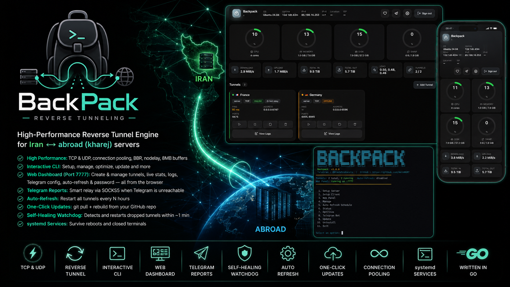

<p align="center"></p>

# Backpack 🎒

**Backpack** is a high-performance **reverse tunnel** engine written entirely in
**Go**, purpose-built for Iran ⇄ abroad (kharej) server setups. It ships as a
single self-contained binary with an interactive CLI **and** a secured web
dashboard — so you can run and manage everything with or without a terminal.

> 📖 **[راهنمای فارسی (Persian) — README_FA.md](README_FA.md)**
>
> TeleGram: **@BlackProtocols** · GitHub: **[AminMGMT/BackPack](https://github.com/AminMGMT/BackPack)**

---

## Features

- **Transports:** TCP, TCP Mux, UDP, WS, WS Mux, WSS & WSS Mux — reverse tunneling with connection pooling (self-signed TLS auto-generated for WSS).
- **Best-Performance preset:** one choice tunes everything (nodelay, large pools,
  8 MB socket buffers, BBR + kernel tuning) for low latency & high throughput.
- **Interactive CLI:** setup, live status, per-tunnel control, optimize, updates.
- **Web dashboard (port 7777):** login-protected, Dark UI with theme
  colors, live CPU/RAM/disk/traffic, per-tunnel status + ping + logs, and you can
  **create & manage tunnels, configure Telegram, change the auto-refresh schedule
  and password — all from the browser.**
- **Telegram reports:** periodic status to an admin; when the server can’t reach
  Telegram (e.g. Iran), it relays through a tunnel peer via a built-in SOCKS5.
- **Auto-refresh:** restart all tunnels every N hours.
- **One-click updates** from your GitHub repo (git pull + rebuild).
- **Full backup & restore:** bundle every tunnel, the panel password, Telegram
  settings, TLS certs and the auto-refresh schedule into a single portable
  `.tar.gz` — from the CLI or the web panel — and restore it on any server.
- **Self-healing watchdog:** detects a dropped tunnel (either side) and restarts it within ~1 minute.
- **systemd-managed** services that survive reboots and closed terminals.

---

## Which side is Server, which is Client?

This is the most important thing to get right:

| Server | Where | Menu option | Why |
|--------|-------|-------------|-----|
| **Iran server** | entry point | **Setup Server** | It exposes the ports; users connect to the **Iran IP** (fast, unfiltered for local users). |
| **Abroad (kharej)** | exit / origin | **Setup Client** | It dials the Iran server and forwards traffic to the real service (VPN panel, etc.). |

```
   end users ──▶  Iran server (SERVER, exposes ports)  ──tunnel──▶  Kharej (CLIENT, real service)
```

**Always set up the Iran server (Server) first, then the abroad server (Client).**
The client needs the Iran address + the token that the server generates.

---

## Install

Run as root on the VPS. **GitHub is blocked from Iran**, so the two sides use
different clone URLs:

**direct:**

```bash
git clone https://github.com/AminMGMT/BackPack.git && cd BackPack && sudo bash install.sh && sudo backpack
```

**Iran — via a GitHub proxy** (folder is still named `BackPack`):

```bash
git clone https://gh-proxy.com/https://github.com/AminMGMT/BackPack.git BackPack && cd BackPack && sudo bash install.sh && sudo backpack
```

`install.sh` builds from the cloned source using **Iran-friendly mirrors**: the
Go toolchain from **Aliyun**, and Go modules from the Iranian **RunFlare** proxy
(`mirror-go.runflare.com`) — so no direct GitHub access is needed to build. It
also uses `GOTOOLCHAIN=local`. It auto-detects:

1. **Local prebuilt** binary (`./backpack`, `dist/`, `prerequisite/`) → installs it.
2. **Source present** (`go.mod`) → builds it.

> **Updates from Iran:** once a tunnel is up, the **Update** button routes
> `git pull` through the tunnel's SOCKS relay to your kharej server (which can
> reach GitHub), so updates keep working even with GitHub blocked. (Requires a
> tunnel that has the SOCKS relay port — e.g. the one set up for the Telegram
> bot.) Otherwise it uses the `gh-proxy.com` remote from the clone above.

### Fully offline install

On a machine with internet, run `bash prerequisite/download-prerequisites.sh`
to bundle the Go toolchain + vendored deps + a prebuilt binary into the folder,
copy the whole folder to the offline VPS, and run `sudo bash install.sh`. See
[`prerequisite/README.md`](prerequisite/).

---

## Quick start

### 1) On the Iran server — create the Server tunnel

**Method A — CLI:**

```bash
sudo backpack   →  1. Setup Server
```

Choose the transport (TCP/TCPMux/UDP/WS/WSMux/WSS/WSSMux), the tunnel port, the exposed ports, accept the suggested
**64-char token** (press Enter), and pick the **Best Performance** preset.
Copy the token — you’ll need it on the client.

**Method B — Web UI:** open `http://<iran-ip>:7777`, log in, click **+ Add
Tunnel**, fill name / port / transport / exposed ports → **Create**. The token
is shown for you to copy.

### 2) On the abroad (kharej) server — create the Client tunnel

```bash
sudo backpack   →  2. Setup Client
```

Enter the **Iran server IP**, the tunnel port, and the **same token**. Done.

---

## The CLI menu

```
1. Setup Server            (Iran — exposes ports)
2. Setup Client            (kharej — connects out)
3. Web Panel               (link + login code, regenerate, restart, stop)
4. Manage                  (Manage tunnels, Status, Restart ALL, Backup & Restore)
5. Auto Refresh Schedule   (restart all tunnels every N hours; 0 = disable)
6. Status                  (live table)
7. Optimize                (BBR + fq, buffers, backlog, file limits)
8. Telegram Bot            (direct or relayed through a tunnel)
9. Update                  (one-click: git pull + rebuild)
10. Uninstall              (removes everything, incl. the source folder)
11. Exit
```

## Web panel (port 7777)

Created automatically with your first tunnel (systemd service `backpack-webui`,
so it stays up after you close the terminal). Open `http://<server-ip>:7777`.

- **Login** with an auto-generated **8-digit code** (or set your own password).
- **Live metrics:** CPU / RAM / disk / swap rings, up/down speed, total traffic,
  uptime, load, hostname, IPv4/IPv6, and the server’s location & ISP.
- **Tunnels:** each card shows status (online/offline/stopped), ping, ports, its
  **country flag**, peer location/ISP, and a **View Logs** drawer — plus
  Start/Stop/Restart/Delete.
- **+ Add Tunnel:** create a server tunnel from the browser — name, port,
  transport, exposed ports, **country**, and an optional **custom SOCKS5 port**
  for the Telegram relay. The generated token is click-to-copy.
- **Header icons:** 💬 Support (links + donation), Telegram bot setup, and
  ⚙️ Settings (theme color, one-click **Update**, **Auto-refresh**, **change
  password**).

> Open port 7777 in the firewall to reach it: `sudo ufw allow 7777`.

## Best Performance

Enabling the preset fills tuned defaults so you only provide the essentials:
`nodelay=true`, `connection_pool=8`, `channel_size=4096`, **8 MB** per-socket
buffers (fills the pipe on high-latency links → higher throughput), and it runs
**Optimize** (BBR + fq, 256 MB buffer ceilings, TCP Fast Open, 1M file limit).
Aggressive pooling is intentionally off to keep idle CPU low.

## Telegram bot

Set it up from the CLI (**Telegram Bot**) or the Web UI (**Settings → Telegram
bot**): bot token (from @BotFather), admin id (from @userinfobot), and the
interval. Reports include the web panel URL and password.

If the server **can’t reach Telegram** (e.g. Iran), choose **Send via a tunnel**:
Backpack exposes a random port on that tunnel mapped to a built-in **SOCKS5**
proxy on the peer (kharej), authenticated by the shared tunnel token, and routes
Telegram through it — **no extra firewall port needed**. Restart the client
tunnel once afterward so it picks up the new relay port.

The bot is **interactive** — every message carries three buttons:

- **📊 Status** — real-time status of all servers/tunnels.
- **🖥 Web UI** — the panel URL and password.
- **💬 Support** — GitHub, Telegram channel, and donation addresses.

## Backup & restore

A backup captures your **entire** Backpack setup in one file: every tunnel
config (with its token), the web-panel password, the Telegram bot settings, the
auto-generated TLS certificates, per-tunnel metadata (country), and the
auto-refresh schedule. It's a plain `.tar.gz` you can copy anywhere.

**From the CLI:** `sudo backpack → 4. Manage → Backup & Restore`

- **Create a backup file** — writes `backpack-backup-YYYYMMDD-HHMMSS.tar.gz`
  to a directory you choose (default `/root`).
- **Restore from a backup file** — give the path to an archive; Backpack
  extracts the configs, re-registers a systemd service for every tunnel, starts
  them, restores the auto-refresh schedule, and brings the web panel back up.

**From the web panel:** open **⚙️ Settings → Backup & restore**

- **Backup** downloads the archive straight to your browser.
- **Restore** uploads an archive and applies it, then reloads the dashboard.

> ⚠️ A backup contains tunnel **tokens** and the **panel password** in plain
> text — keep it private. Restoring **overwrites** any tunnel/setting with the
> same name; tunnels that only exist locally are left untouched.

**Typical use — migrate to a new server:** install Backpack on the new box
(`sudo bash install.sh`), copy your `.tar.gz` over, then restore it from the CLI
or panel. All tunnels and settings come back exactly as they were.

## Updates

**Update** (CLI item 9, or Web UI → Settings → Update) does a `git pull` in the
cloned repo, rebuilds the binary, and restarts the services. Just push your
changes to GitHub and click Update on the server.

## Layout

```
main.go                 dispatch: engine (-c) / menu / --webui / --telegram-report / --restart-all
config/ , cmd/          tunnel schema + engine runner (TCP/UDP/…)
internal/server|client  data-plane transports
internal/app            shared paths/constants
internal/tui            terminal helpers
internal/manage         setup, systemd, tunnels, status, tokens, web API, updater
internal/optimize       kernel/network tuning
internal/schedule       cron helpers (auto-refresh)
internal/telegram       Telegram reporter (direct or via SOCKS tunnel)
internal/socks          built-in SOCKS5 proxy (server + dialer)
internal/webui          web dashboard (auth, live stats, tunnel create/manage, settings)
internal/menu           interactive CLI menu
```

## Support & donate

If Backpack helps you, a star or a small tip is appreciated. 🙏

- GitHub: **https://github.com/AminMGMT**
- Telegram channel: **https://t.me/BlackProtocols**

| Coin | Address |
|------|---------|
| **Tron (TRX)** | `TTzuUAtsEsrLgNpFVLNTyLVJVRRFNWESYc` |
| **USDT (BEP20)** | `0xc112AE9bfF7c59dEcFb34E988A397848D3093E82` |
| **Toncoin (TON)** | `UQD9g40QubAICJ6zPqegtCY7s-joMx2DB8aIqA0xF1aHoCDs` |

## License

**Copyright © 2026 Amin Mohammadi (AminMGMT).**
Released under the **GNU Affero General Public License v3.0 (AGPL-3.0)** — see
[LICENSE](LICENSE) and [NOTICE](NOTICE).
