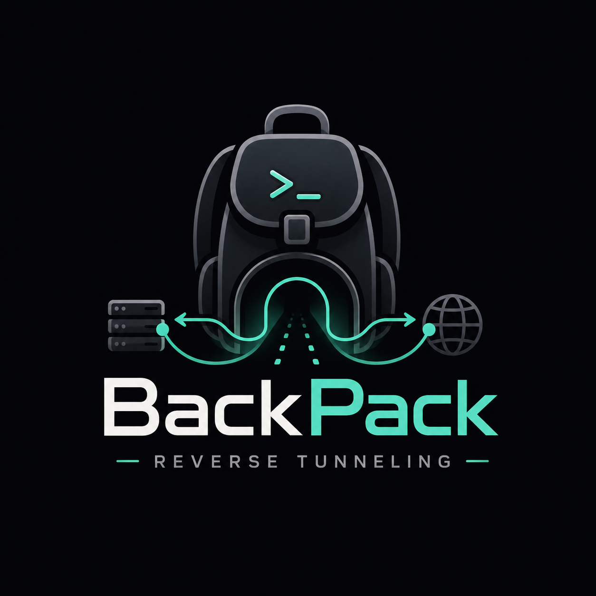

<p align="center"></p>

# Backpack 🎒

**Backpack** is a high-performance **reverse tunnel** engine written entirely in
**Go**, purpose-built for Iran ⇄ abroad (kharej) server setups. It ships as a
single self-contained binary with an interactive CLI **and** a secured web
dashboard — so you can run and manage everything with or without a terminal.

> 📖 **[راهنمای فارسی (Persian) — README_FA.md](README_FA.md)**
>
> TeleGram: **@BlackProtocols** 

---

## Features

- **Transports:** TCP, TCP Mux, UDP, WS, WS Mux, WSS & WSS Mux — reverse tunneling with connection pooling (self-signed TLS auto-generated for WSS).
- **Best-Performance preset:** one choice tunes everything (nodelay, large pools,
  8 MB socket buffers, BBR + kernel tuning) for low latency & high throughput.
- **Interactive CLI:** setup, **edit ports & transport**, live status, per-tunnel
  control, **health check**, optimize, backup/restore, Telegram, updates.
- **Automatic failover:** a client can keep backup server addresses (second IP,
  another port, a CDN edge) and switches to them on its own when the main
  address gets filtered — the tunnel stays up without you touching anything.
- **Never breaks itself:** updates and edits save a restore point, verify the
  result, and **roll back automatically** if the tunnel doesn't come back up.
- **Health check:** one screen that tests the server, the panel and every tunnel
  and tells you exactly how to fix whatever is wrong.
- **Monitoring web dashboard (port 7777):** login-protected dark UI with live
  CPU/RAM/disk/traffic, per-tunnel status + ping + logs. Monitoring-only — best
  run on the **Iran** server. (Settings: theme, update, panel port, password.)
- **Telegram reports through a tunnel:** periodic status to an admin, relayed
  through a tunnel peer via a built-in SOCKS5 — works 100% from Iran where
  Telegram is blocked.
- **Auto-refresh:** restart all tunnels every N hours (under **Manage**).
- **Release-based updates:** one click downloads the latest GitHub release
  (direct → tunnel relay → mirrors) and swaps the binary — no Go, no git.
- **Full backup & restore:** bundle every tunnel, the panel password, Telegram
  settings, TLS certs and the auto-refresh schedule into a single portable
  `.tar.gz`, kept in `/root/BackPack/backups`.
- **Self-healing watchdog:** detects a dropped tunnel (either side) and restarts it within ~1 minute.
- **systemd-managed** services that survive reboots and closed terminals.

---

## Which side is Server, which is Client?

This is the most important thing to get right:

| Server | Where | Menu option | Why |
|--------|-------|-------------|-----|
| **Iran server** | entry point | **Setup Server** | It exposes the ports; users connect to the **Iran IP** (fast, unfiltered for local users). |
| **Abroad (kharej)** | exit / origin | **Setup Client** | It dials the Iran server and forwards traffic to the real service (VPN panel, etc.). |

```
   end users ──▶  Iran server (SERVER, exposes ports)  ──tunnel──▶  Kharej (CLIENT, real service)
```

**Always set up the Iran server (Server) first, then the abroad server (Client).**
The client needs the Iran address + the token that the server generates.

---

## Install

One command as root on the VPS — it downloads the prebuilt **release tar.gz**
for your architecture (amd64/arm64) into **`/root/BackPack`** and installs the
binary. It tries GitHub **directly first**, then falls back to public mirrors
that work from Iran:

```bash
bash <(curl -fsSL https://raw.githubusercontent.com/AminMGMT/BackPack/main/install.sh)
```

**Iran — if GitHub raw is blocked**, fetch the script through a proxy (the
installer itself already handles mirror fallback for the release download):

```bash
bash <(curl -fsSL https://gh-proxy.com/https://raw.githubusercontent.com/AminMGMT/BackPack/main/install.sh)
```

Then open the menu:

```bash
sudo backpack
```

Everything lives in a tidy layout: the release bundle in `/root/BackPack`,
backups in `/root/BackPack/backups`, tunnel configs in `/etc/backpack`.

> **Building from source** still works as a fallback: clone the repo and run
> `sudo bash install.sh` inside it — if the release download fails it builds
> with Go, fetching modules **directly first** and via Iran-friendly mirrors
> (RunFlare, goproxy.cn) only when direct access fails.

### Offline install (server has no usable internet)

On any machine **with** internet, download two files from the
[releases page](https://github.com/AminMGMT/BackPack/releases/latest):

1. `install.sh`
2. the latest `backpack_linux_amd64.tar.gz` (or `..._arm64.tar.gz` — check the
   server with `uname -m`; from Iran you can prefix the download URL with
   `https://gh-proxy.com/`)

Copy both into the **same folder** on the VPS and run the installer — it finds
the local tar.gz automatically, so no internet is needed on the server:

```bash
scp install.sh backpack_linux_amd64.tar.gz root@SERVER_IP:/root/
ssh root@SERVER_IP "cd /root && sudo bash install.sh"
```

---

## Quick start

### 1) On the Iran server — create the Server tunnel

```bash
sudo backpack   →  1. Setup Server
```

Choose the transport (TCP/TCPMux/UDP/WS/WSS/WSMux/WSSMux), the tunnel port, the
exposed ports, accept the suggested **64-char token** (press Enter), and pick
the **Best Performance** preset. Copy the token — you’ll need it on the client.

### 2) On the abroad (kharej) server — create the Client tunnel

```bash
sudo backpack   →  2. Setup Client
```

Enter the **Iran server IP**, the tunnel port, and the **same token**. Done.

---

## Quick overview

- **CLI menu (`sudo backpack`):** Setup Server / Setup Client · **Manage**
  (per-tunnel **Edit** for ports, transport and backup server addresses,
  start/stop/restart, live log, delete · live status · **Health Check** ·
  restart all · auto refresh · **File Locations**) · **Backup & Restore** ·
  **Web Panel** · Optimize · Telegram Bot · **Update** (with restore points) ·
  Uninstall. Every option shows a short gray description beside it.
- **Backup server addresses:** on a client, add extra addresses in
  **Edit → Backup server addresses** (`1.2.3.4, 5.6.7.8:8443, edge.example.com:443`).
  If the main one stops answering the client fails over automatically — this is
  what keeps a tunnel alive after a server IP gets filtered.
- **Health Check & File Locations:** under **Manage**. The health check verifies
  kernel tuning, the panel, every tunnel's state, real TCP reachability, TLS
  expiry and token strength, and prints a fix under each problem.
- **Web panel (port 7777):** a **monitoring-only** dashboard — live
  CPU/RAM/disk/traffic, tunnel state + real ping + logs. Best run on the
  **Iran** server; the link & login code are shown in the CLI under
  **Web Panel** (settings: theme, update, panel port, password).
  Open the port first: `sudo ufw allow 7777`.
- **Telegram bot:** periodic status reports sent **through a tunnel** — a
  random port on the tunnel maps to a built-in SOCKS5 proxy on the kharej
  peer, so it works 100% from Iran. Interactive buttons: Status / Web UI /
  Support.
- **Best Performance preset:** fills tuned defaults (nodelay, pools, 8 MB
  socket buffers) and applies kernel tuning (BBR + fq, buffer ceilings,
  file limits).
- **Backup & restore:** everything (tunnels + tokens, panel password, Telegram,
  TLS certs, schedule) in one portable `.tar.gz` under `/root/BackPack/backups`;
  restore re-registers and starts every tunnel.
- **Updates:** the **Update** menu detects a newer GitHub release and installs
  the prebuilt `backpack_linux_<arch>.tar.gz` (direct → tunnel relay → public
  mirrors — works from Iran). It saves a **restore point** first, health-checks
  afterwards, and rolls back by itself if anything fails to come up; you can also
  roll back on demand from **Update → Restore points**. Upgrading from an old
  clone-based install (≤ v1.2.0): run Update once; after that it is release-based.
- **Layout on the server:** release bundle + backups in `/root/BackPack`,
  tunnel configs in `/etc/backpack`, binary at `/usr/local/bin/backpack`.

## Support & donate

If Backpack helps you, a star or a small tip is appreciated. 🙏

- Telegram channel: **https://t.me/BlackProtocols**

| Coin | Address |
|------|---------|
| **Tron (TRX)** | `TTzuUAtsEsrLgNpFVLNTyLVJVRRFNWESYc` |
| **USDT (BEP20)** | `0xc112AE9bfF7c59dEcFb34E988A397848D3093E82` |
| **Toncoin (TON)** | `UQD9g40QubAICJ6zPqegtCY7s-joMx2DB8aIqA0xF1aHoCDs` |

## License

**Copyright © 2026 Amin Mohammadi (AminMGMT).**
Released under the **GNU Affero General Public License v3.0 (AGPL-3.0)** — see
[LICENSE](LICENSE) and [NOTICE](NOTICE).
