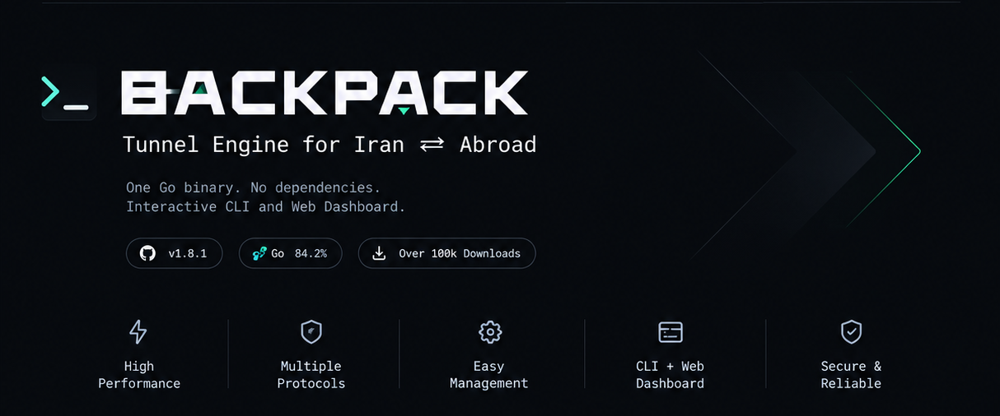
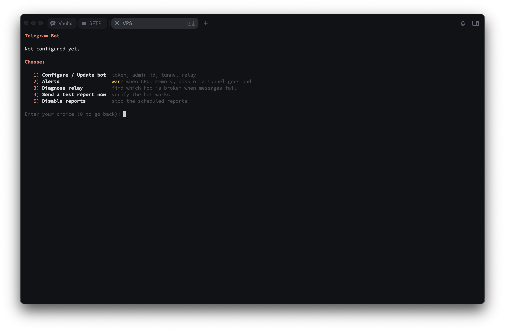

<p align="center"></p>

# Backpack 🎒

<p align="center">
  <a href="go.mod"></a>
  <a href="https://github.com/AminMGMT/BackPack/releases/latest"></a>
  <a href="LICENSE"></a>
  <a href="https://github.com/AminMGMT/BackPack/stargazers"></a>
  <a href="https://github.com/AminMGMT/BackPack/releases"></a>
</p>

**Backpack** is a tunnel engine for Iran ⇄ abroad (kharej) servers. One Go
binary, no dependencies: an interactive CLI **and** a web dashboard, so you can
run everything with or without a terminal.

<p align="center">
  <b><a href="tutorial/README.md">📘 Setup tutorials</a></b> ·
  <b><a href="docs/README.md">📚 Documentation</a></b> ·
  <b><a href="README_FA.md">🇮🇷 راهنمای فارسی</a></b> ·
  <b><a href="https://t.me/BlackProtocols">Telegram Channel</a></b> ·
  <b><a href="https://t.me/BlackProtocolsGroup">Telegram Group</a></b>
</p>

---

## How it works

```
  end users ──▶  IRAN server  ══ tunnel ══▶  KHAREJ server  ──▶  real service
                 exposes the ports            holds the service
```

A user connects to a **forwarded port** on the Iran server. The engine carries
that connection through **one transport** to the kharej side, which hands it to
the **real service**.

**The ports never move.** Iran always exposes them and kharej always holds the
service. What you choose is *who reaches out first*, and *what travels between
them*:

| | Who dials | Carries | Choose it when |
|---|---|---|---|
| **[Reverse](#reverse-tunnel--12-transports)** | kharej → Iran | forwarded ports | the usual case: Iran can accept an inbound connection |
| **[Direct](#direct-tunnel--6-carriers)** | Iran → kharej | a private network, with forwarded ports over it | an inbound connection to Iran does not get through |

Both are built the same way — run `sudo backpack`, pick **Setup Iran** or
**Setup Kharej** for the machine you are on, and the wizard asks the rest.

---

## Reverse tunnel — 12 transports

Kharej dials Iran, so **Iran needs one open port** and kharej needs none. Pick
the transport that matches what your route allows; **Manage → Link Test**
measures the route and recommends one if you are not sure.

| Transport | What it is, in one line | Needs | Guide |
|---|---|---|---|
| **TCP** | A plain TCP connection per flow. The starting point when nothing is filtered. | — | [→](tutorial/tcp.md) |
| **TCP Mux** | The same, with many flows sharing a few connections. For a service that opens lots of short ones. | — | [→](tutorial/tcp-mux.md) |
| **TCP + Stealth** | TCP with a Noise record layer over it — **looks like random bytes, no fingerprint at all**. | — | [→](tutorial/tcp-stealth.md) |
| **TCP + PCK** | TCP segments built without a socket: no kernel handshake, no connection state. For a path where TCP connects and then stalls, resets or is throttled. | Linux, root | [→](tutorial/tcp-pck.md) |
| **UDP** | Raw UDP datagrams. Lowest overhead, no recovery of its own. | UDP open | [→](tutorial/udp.md) |
| **UDP + KCP + FEC** | UDP with error correction that repairs loss instead of waiting for a retransmit. **The gaming and lossy-route answer.** | UDP open | [→](tutorial/udp-kcp-fec.md) |
| **UDP + QUIC** | A real QUIC session: TLS 1.3, its own congestion control, nothing to tune. | UDP open | [→](tutorial/udp-quic.md) |
| **WS** | A WebSocket over plain HTTP. For a route where only HTTP gets through. | — | [→](tutorial/websocket.md) |
| **WS Mux** | The same, multiplexed. | — | [→](tutorial/websocket.md) |
| **WSS** | A WebSocket inside TLS, dialled with a real **Chrome** handshake and answering every probe with a **decoy website**. Looks like an ordinary HTTPS site, and passes through a CDN. | certificate | [→](tutorial/websocket-tls.md) |
| **WSS Mux** | The same, multiplexed. | certificate | [→](tutorial/websocket-tls.md) |
| **xDi (ICMP)** | The tunnel inside ping packets, for a path that filters TCP and UDP but not ICMP. | Linux, root, ICMP open | [→](tutorial/xdi-icmp.md) |

**[→ All twelve compared, setting by setting](docs/transports.md)** ·
**[→ Which one should I pick?](docs/choosing-a-transport.md)** ·
**[→ What to do when a server is filtered or dirty](docs/filtered-or-dirty-ip.md)**

> On **TCP, TCP Mux, UDP, WS and WS Mux** the token travels as-is. On an
> untrusted path use one of the encrypted ones — Stealth, PCK, KCP, QUIC, WSS.

---

## Direct tunnel — 6 carriers

Iran dials **out**, so **no inbound port on Iran is needed at all**. This one is
a full IP tunnel: an interface on each host carrying whole IP packets, so the
two servers share a private network and anything can be routed over it — and
forwarded ports work over the top exactly as they do on a reverse tunnel.

Every direct tunnel is **GRE + Noise**: encrypted, mutually authenticated, with
a replay window, and it **measures its own MTU** once it is up. What you choose
is only the carrier that wrapping travels inside.

| Carrier | What it looks like on the wire | Needs | Guide |
|---|---|---|---|
| **udp** | Ordinary UDP datagrams. The default, and the fastest. | UDP open | [→](docs/l3-direct-tunnel.md) |
| **quic** | A real QUIC session carrying the tunnel in RFC 9221 datagrams. | UDP open | [→](docs/l3-direct-tunnel.md) |
| **pck** | TCP segments built below the kernel — no handshake, no connection state. The answer when UDP is throttled. | Linux, root | [→](docs/tcp-pck.md) |
| **sni** | `pck`, with a TLS hello naming an allowed domain at the front of the flow. | Linux, root | [→](docs/l3-direct-tunnel.md) |
| **xdi** | ICMP echo, for a path that filters UDP and TCP but not ping. | Linux, root, ICMP open | [→](docs/l3-direct-tunnel.md) |
| **spoof** | Raw IP with a **forged source address**, for a path that blocks or counts by source. | Linux, root, a path that passes forged sources | [→](docs/ip-spoofing.md) |

All six are built the same way — `sudo backpack` → **Setup Iran** or
**Setup Kharej** → **Direct** → pick the carrier — and one page covers every
one of them:

**[→ The direct tunnel in full](docs/l3-direct-tunnel.md)** ·
**[→ IP spoofing, setting by setting](docs/ip-spoofing.md)** · [its setup page](tutorial/ip-spoofing.md) ·
**[→ TCP + PCK explained](docs/tcp-pck.md)** ·
**[→ The older layer-4 direct tunnel](docs/direct-tunnel.md)** · [its setup page](tutorial/direct-tunnel.md)

---

## Install

One command as root on the VPS. It downloads the release for your architecture,
**verifies it against the published checksum**, installs it and opens the menu:

```bash
bash <(curl -fsSL https://raw.githubusercontent.com/AminMGMT/BackPack/main/install.sh)
```

Reopen the menu any time with `sudo backpack`.

> **No internet on the server?** There is a full offline path — copy one archive
> across and go. Building from source works as a fallback.
> **→ [Installing Backpack](docs/install.md)**

---

## Quick start

**Get the roles right first** — it is the one thing people trip on.

| Server | Menu option | What it does |
|---|---|---|
| **Iran** | **1. Setup Iran** | Exposes the ports. Users connect to the **Iran IP**. |
| **Kharej** | **2. Setup Kharej** | Holds the real service. Dials the Iran server. |

**Set up Iran first** — kharej needs the Iran address and the token Iran
generates.

```bash
# on the IRAN server
sudo backpack   →  1. Setup Iran
#   transport → tunnel port → name → COPY THE TOKEN → exposed ports
#   → UDP? → preset (Turbo) → done

# on the KHAREJ server
sudo backpack   →  2. Setup Kharej
#   same transport → Iran IP + same tunnel port → name → SAME TOKEN
#   → same preset → done
```

Then **Manage → Status** to see both ends, and **Manage → Health Check** if
anything looks wrong — it prints a fix under each problem.

**[→ Before you start](tutorial/before-you-start.md)** covers the roles, the
token, the port mapping and the firewall in full. Every transport then has its
own step-by-step page.

> Running **X-UI, 3x-ui or Marzban** on the kharej server? That is the most
> common deployment and it has four things of its own —
> **[→ Behind a panel](tutorial/behind-a-panel.md)**.

---

## Why Backpack?

- **UDP on any forwarded port** — Xray/3x-ui, Shadowsocks, WireGuard, DNS,
  games. On **every** transport, with one switch.
  [How](tutorial/udp-forwarding.md)
- **No fingerprint** — Stealth is random bytes; WSS dials with a real Chrome TLS
  handshake and answers every probe with a decoy website.
  [Camouflage](docs/camouflage.md)
- **It moves when the route does** — backup addresses with health scoring, a
  [transport fallback chain](docs/transport-fallback.md) that changes carrier on
  its own, and multi-exit steering to the healthiest server.
- **Nothing left broken** — an update or an edit that breaks a tunnel
  **reverts itself**, and a watchdog notices a stall — not just a stopped
  service — and works up a ladder before restarting anything.
- **It tells you what is wrong** — Health Check prints a fix under each problem;
  Link Test measures the route and recommends a transport and its timers.
  [Troubleshooting](docs/troubleshooting.md)
- **Telegram from Iran** — status and alerts reach Telegram *through* a tunnel
  peer, picking the tunnel itself and moving when one dies.
  [Telegram bot](docs/telegram-bot.md)
- **A fleet from one screen** — register another server once over SSH and build
  both ends of a tunnel from one page. [Managed servers](docs/managed-servers.md)
- **Offline installer** — install or update with no internet at all.

<details>
<summary><b>The full feature list</b></summary>

**Performance** — four presets (Balance, **Turbo**, Aggressive, Throughput) fill
in every tuning value at once; **Optimize** applies kernel and network tuning
(BBR + fq, buffer ceilings, file limits); **Link Test** derives the liveness
timers from your real round trip. [Presets](docs/performance-presets.md) ·
[Measurements](docs/performance-notes.md)

**Reliability** — failover to backup addresses with health scoring
(`rtt + 2·jitter + 20·loss%`) or load balancing across all of them; a transport
fallback chain; a self-healing watchdog; automatic rollback; systemd services
that survive reboots. [Failover](docs/failover-load-balancing.md)

**Security** — the token never travels in the clear on an encrypted transport;
**two-factor sign-in** on the panel with recovery codes; scoped API tokens and
an audit record written by the authorisation guard itself; PROXY protocol v2 for
real client IPs; per-tunnel connection and bandwidth caps; SHA-256 verified
downloads, and anything unverifiable is refused rather than installed.
[Access control](docs/access-control.md) · [Limits](docs/limits.md)

**Management** — an interactive CLI where every option explains itself; a web
panel under a secret path; a built-in SOCKS5/HTTP proxy so the tunnel exit can
be its own backend; JSON logs with a stable schema; auto-refresh every N hours.
[CLI menu](docs/cli-menu.md) · [Web panel](docs/web-panel.md) ·
[Log shipping](docs/log-schema.md)

**Monitoring** — live CPU/RAM/disk/traffic and per-tunnel status, ping and logs;
metrics including KCP retransmits, loss and FEC repairs, kept across restarts;
Telegram alerts with a recovery message for each.
[Tunnel metrics](docs/tunnel-metrics.md) · [Alerts](docs/alerts.md) ·
[Health Check](docs/health-check.md)

**Maintenance** — one-file backup of every tunnel, the panel password, Telegram
settings, certificates and the schedule; verified updates on a stable or beta
channel. [Backup & restore](docs/backup-restore.md) · [Updates](docs/updates.md)

</details>

---

## Documentation

**Start here**

| | |
|---|---|
| **[📘 Tutorials](tutorial/README.md)** | Step by step, one page per transport — every question the wizard asks, with the answer to give |
| **[📚 Docs index](docs/README.md)** | Reference: what each part is, and every setting it has |
| **[🚑 Troubleshooting](docs/troubleshooting.md)** | Ordered by how often each cause is actually the answer |
| **[🖥 CLI menu](docs/cli-menu.md)** | Every option in every menu, including Fine Tune |

**Tunnels and transports**

| | |
|---|---|
| [Transports](docs/transports.md) · [Choosing one](docs/choosing-a-transport.md) | All twelve compared, and how to decide |
| [Direct tunnel](docs/l3-direct-tunnel.md) · [Layer-4 direct](docs/direct-tunnel.md) | The full IP tunnel, and the older port-forwarding one |
| [Port mappings](docs/port-mappings.md) · [Forwarded UDP](docs/forwarded-udp.md) | Every form `ports = [...]` accepts; what to read when UDP does not pass |
| [Transport fallback](docs/transport-fallback.md) · [Failover](docs/failover-load-balancing.md) | When the carrier is blocked, and when the address is |
| [Camouflage](docs/camouflage.md) · [IP spoofing](docs/ip-spoofing.md) · [TCP + PCK](docs/tcp-pck.md) | The decoy site, the forged source, and TCP without the kernel |
| [MSS clamp](docs/mss-clamp.md) · [Filtered or dirty IP](docs/filtered-or-dirty-ip.md) | The fix for "connects but carries nothing", and for a blocked address |

**Running it**

| | |
|---|---|
| [Install](docs/install.md) · [Updates](docs/updates.md) · [Backup & restore](docs/backup-restore.md) | Getting it on, keeping it current, getting it back |
| [Web panel](docs/web-panel.md) · [Screen by screen](docs/web-panel-screens.md) · [Access control](docs/access-control.md) | The dashboard, every screen it has, and who may do what |
| [Managed servers](docs/managed-servers.md) · [Monitor service](docs/monitor-service.md) | A fleet from one screen, and the service that watches it |
| [Telegram bot](docs/telegram-bot.md) · [Alerts](docs/alerts.md) · [Health Check](docs/health-check.md) | What it tells you, and when |
| [Tunnel metrics](docs/tunnel-metrics.md) · [Log shipping](docs/log-schema.md) · [Real client IP](docs/real-client-ip.md) | What it measures, and how to get it off the server |
| [Limits](docs/limits.md) · [Presets](docs/performance-presets.md) · [Server layout](docs/server-layout.md) | Caps, tuning, and where everything lives on disk |

**Under the hood**

| | |
|---|---|
| [Architecture](docs/architecture.md) · [Configuration reference](docs/config-reference.md) | What it is made of, and every key it reads |
| [Design decisions](docs/design-decisions.md) · [Performance notes](docs/performance-notes.md) | What it deliberately does not do, and the measurements that settled it |
| [Releasing](docs/releasing.md) · [Contributing](CONTRIBUTING.md) | The release checklist, and how this codebase is written |

Every page carries a Persian summary at the bottom.

---

## Screenshots

| CLI menu | Web panel |
|----------|-----------|
|  |  |

| Tunnel management | Telegram bot |
|-------------------|--------------|
|  |  |

---

## Support & donate

If Backpack helps you, a star or a small tip is appreciated. 🙏

- Telegram channel: **[@BlackProtocols](https://t.me/BlackProtocols)**
- Telegram group: **[@BlackProtocolsGroup](https://t.me/BlackProtocolsGroup)**

| Coin | Address |
|------|---------|
| **Tron (TRX)** | `TTzuUAtsEsrLgNpFVLNTyLVJVRRFNWESYc` |
| **USDT (BEP20)** | `0xc112AE9bfF7c59dEcFb34E988A397848D3093E82` |
| **Toncoin (TON)** | `UQD9g40QubAICJ6zPqegtCY7s-joMx2DB8aIqA0xF1aHoCDs` |

---

## License

**Copyright © 2026 Amin Mohammadi (AminMGMT).**
Released under the **GNU Affero General Public License v3.0 (AGPL-3.0)** — see
[LICENSE](LICENSE) and [NOTICE](NOTICE).

You may use, study, modify, redistribute and build a business on this. Two
conditions come with it, both permitted by Section 7 of that licence and neither
taking away anything it grants:

- **Keep the attribution.** A modified version must carry this line in its
  NOTICE, its README, its version output and the notices its panel shows:

  > Based on BackPack by Amin Mohammadi (AminMGMT)
  > https://github.com/AminMGMT/BackPack

- **Use your own name.** "BackPack", the name and the logo are not licensed with
  the code — a fork needs a name of its own. Saying truthfully that your work is
  based on or compatible with BackPack is always fine. See
  [TRADEMARK.md](TRADEMARK.md).
