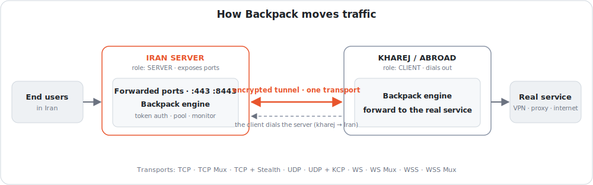
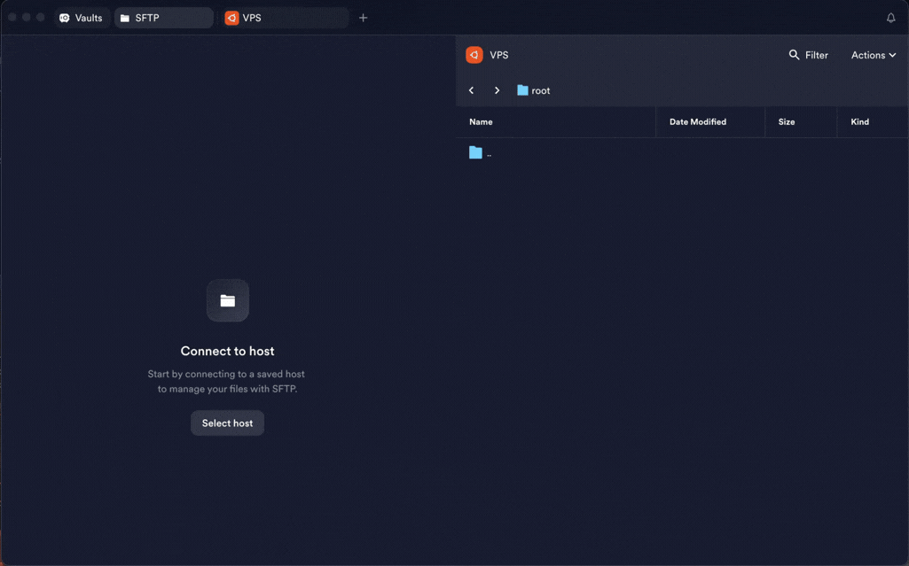
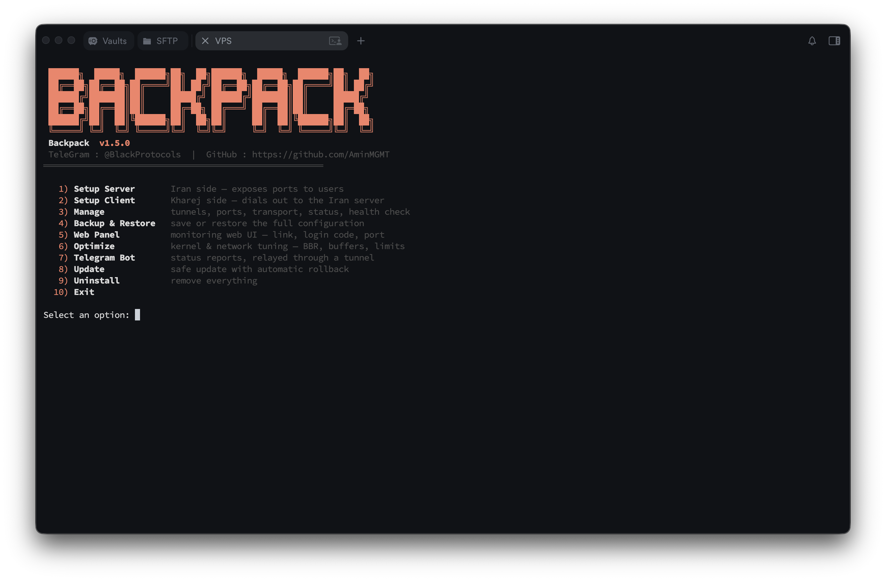
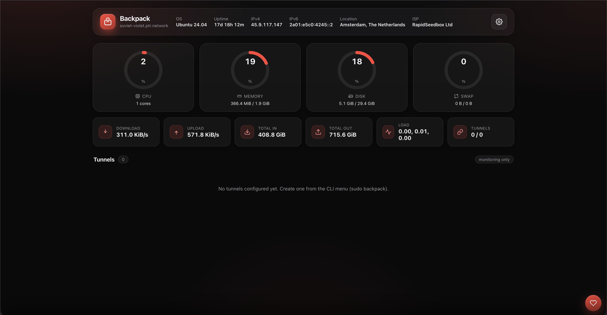
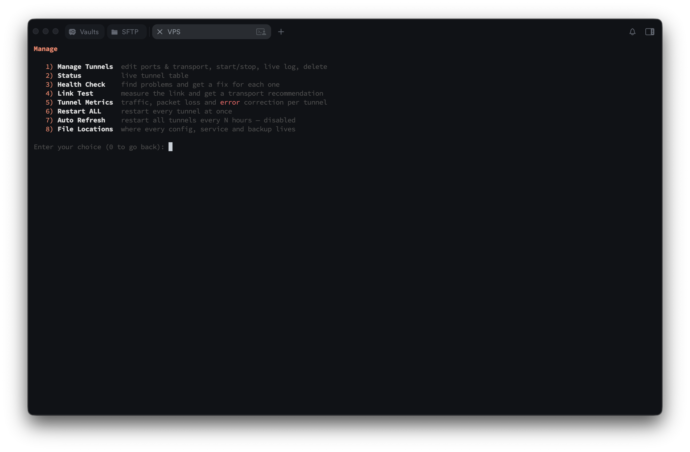
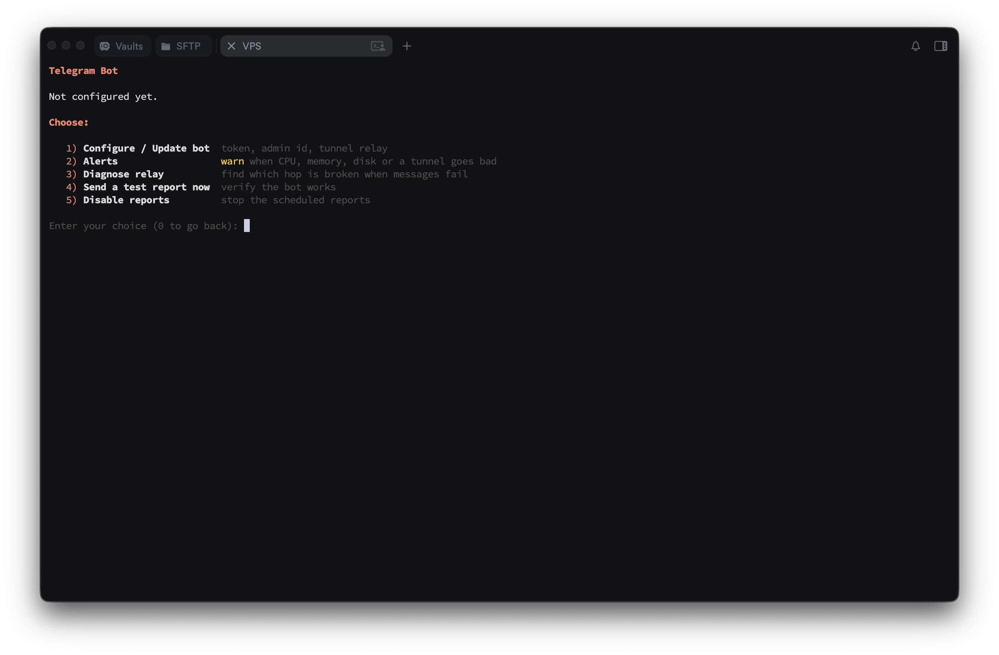

<div dir="rtl">

<p align="center"></p>

# بک‌پک 🎒

<p align="center">
  <a href="go.mod"></a>
  <a href="https://github.com/AminMGMT/BackPack/releases/latest"></a>
  <a href="LICENSE"></a>
  <a href="https://github.com/AminMGMT/BackPack/stargazers"></a>
  <a href="https://github.com/AminMGMT/BackPack/releases"></a>
</p>

**بک‌پک** یک هسته‌ی تونل معکوس (Reverse Tunnel) با کارایی بالاست که کاملاً با **Go**
نوشته شده و برای ست‌آپ سرور ایران ⇄ خارج طراحی شده. یک باینری واحد است با یک منوی
تعاملی CLI **و** یک پنل وب امن — یعنی همه‌چیز را با ترمینال یا بدون ترمینال می‌توانی
مدیریت کنی.

> 📖 English guide: **[README.md](README.md)**
>
> تلگرام: **[@BlackProtocols](https://t.me/BlackProtocols)**

---

## معماری

<p align="center"></p>

کاربر به یک **پورت forward‌شده** روی سرور ایران وصل می‌شود؛ انجین آن را از طریق
**یک ترنسپورت** به کلاینت خارج می‌برد و کلاینت آن را به **سرویس واقعی** می‌رساند.
خودِ تونل همیشه **توسط کلاینت** برقرار می‌شود (خارج → ایران)، پس سمت خارج نیازی به
پورت ورودی باز ندارد.

---

## چرا بک‌پک؟

- **چند-ترنسپورت (Multi-transport):** نه ترنسپورت روی TCP، UDP و WebSocket — به‌جای
  جنگیدن با مسیر، با آن هماهنگ می‌شوی.
- **بازگشت خودکار (Automatic rollback):** آپدیت یا ویرایشی که تونل را خراب کند
  خودش برمی‌گردد عقب، پس هیچ‌وقت با تونل مرده تنها نمی‌مانی.
- **Link Test:** مسیر واقعی‌ات را می‌سنجد و ترنسپورت مناسب را — با تایمرهای متناسب —
  پیشنهاد می‌دهد.
- **Stealth:** ترنسپورت رمزنگاری‌شده‌ی **بدون fingerprint**؛ روی سیم شبیه بایت
  تصادفی است، پس چیزی برای تشخیص نیست.
- **Chrome TLS fingerprint:** WSS با handshake یک مرورگر واقعی dial می‌کند، پس
  به‌جای اینکه شبیه «یک برنامه‌ی Go» باشد، در HTTPS معمولی گم می‌شود.
- **رله‌ی تلگرام (Telegram relay):** وضعیت و هشدارها **از ایران** از طریق یک تونل
  بیرون می‌روند و به تلگرام می‌رسند — حتی خودش تونل را انتخاب می‌کند.
- **نصاب آفلاین (Offline installer):** نصب یا آپدیت سرور **بدون هیچ اینترنتی**؛ یک
  آرشیو را کپی کن و تمام.
- **واچ‌داگ خودترمیم (Self-healing watchdog):** تونل drop‌شده در حدود ۱ دقیقه توسط
  سرویسی مستقل از پنل وب ری‌استارت می‌شود.

---

## نصب

فقط یک دستور با کاربر root روی VPS — فایل **tar.gz ریلیز** مخصوص معماری سرورت
(amd64/arm64) در **`/root/BackPack`** دانلود می‌شود، با چک‌سام منتشرشده‌ی همان
ریلیز تأیید می‌شود، و بعد باینری نصب می‌شود:

</div>

```bash
bash <(curl -fsSL https://raw.githubusercontent.com/AminMGMT/BackPack/main/install.sh)
```

<div dir="rtl">

وقتی تمام شد، **خودش منو را باز می‌کند**. دفعات بعد هر وقت خواستی با این بازش کن:

</div>

```bash
sudo backpack
```

<div dir="rtl">

همه‌چیز مرتب و در یک‌جا: باندل ریلیز در `/root/BackPack`، بکاپ‌ها در
`/root/BackPack/backups`، کانفیگ تونل‌ها در `/etc/backpack`.

> **build از سورس** به‌عنوان راه دوم هنوز کار می‌کند: ریپو را clone کن و داخلش
> `sudo bash install.sh` بزن — اگر دانلود ریلیز شکست بخورد، با Go build می‌کند
> (ماژول‌ها اول **مستقیم**، و فقط اگر نشد از میرورهای RunFlare/goproxy.cn).

### نصب آفلاین (وقتی سرور به گیت‌هاب دسترسی ندارد)

ریلیز را روی سیستمی که اینترنت دارد دانلود کن، به سرور کپی کن، و همان‌جا نصبش
کن. هیچ‌چیزی از روی VPS دانلود نمی‌شود.



از [صفحه‌ی ریلیزها](https://github.com/AminMGMT/BackPack/releases/latest) آرشیو
مخصوص معماری سرور را بردار — روی سرور `uname -m` بزن:
`x86_64` یعنی `backpack_linux_amd64.tar.gz` و `aarch64` یعنی `backpack_linux_arm64.tar.gz`.

**با نصاب** (پیشنهادی — مسیر نصب را هم برای حذف‌کننده ثبت می‌کند). فایل‌های
`install.sh` و `SHA256SUMS` را هم کنار آرشیو دانلود کن، هر سه را در **یک فولدر**
روی VPS بگذار و اجرا کن. خودش آرشیو محلی را پیدا می‌کند، با `SHA256SUMS` تأییدش
می‌کند، و اصلاً سراغ شبکه نمی‌رود:

</div>

```bash
scp install.sh SHA256SUMS backpack_linux_amd64.tar.gz root@SERVER_IP:/root/
ssh root@SERVER_IP "cd /root && sudo bash install.sh"
```

<div dir="rtl">

**دستی**، اگر ترجیح می‌دهی اسکریپت اجرا نکنی. آرشیو را روی سرور آپلود کن و با
کاربر root:

</div>

```bash
sha256sum backpack_linux_amd64.tar.gz        # با SHA256SUMS مقایسه کن
tar xzf backpack_linux_amd64.tar.gz
mkdir -p /etc/backpack /root/BackPack/backups
install -m 0755 backpack /usr/local/bin/backpack
echo /root/BackPack > /etc/backpack/install_path
sudo backpack
```

<div dir="rtl">

خط `install_path` همان چیزی است که حذف‌کننده‌ی داخلی می‌خواند تا بداند چه چیزی را
پاک کند؛ اگر نگذاری همه‌چیز کار می‌کند ولی حذف نصب باید دستی انجام شود. دستور
`install -m 0755` خودش بیت اجرا را ست می‌کند، پس `chmod` بعدش لازم نیست.

> **آپدیت آفلاین** هم دقیقاً همین است: همین مراحل را با آرشیو جدیدتر تکرار کن.
> `install` باینری را سرجایش عوض می‌کند و تونل‌های `/etc/backpack` دست‌نخورده
> می‌مانند. بعدش با `sudo backpack` → *Restart ALL* ری‌استارتشان کن.

---

## شروع سریع

**اول نقش‌ها را درست بگیر** — تنها جایی که همه اشتباه می‌کنند همین است:

| سرور | نقش | گزینه‌ی منو | چرا |
|------|-----|------------|-----|
| **سرور ایران** | ورودی | **Setup Server** | پورت‌ها را expose می‌کند؛ کاربر به **IP ایران** وصل می‌شود (سریع و بدون فیلتر). |
| **سرور خارج** | خروجی | **Setup Client** | به سرور ایران dial می‌کند و ترافیک را به سرویس واقعی می‌رساند. |

</div>

```
   کاربر ──▶  سرور ایران (SERVER، پورت‌ها را expose می‌کند)  ──تونل──▶  خارج (CLIENT، سرویس واقعی)
```

<div dir="rtl">

**همیشه اول سرور ایران (Server) را ست کن**، بعد سرور خارج (Client) را — کلاینت به
آدرس ایران و توکنی که سرور می‌سازد نیاز دارد.

### ۱) روی سرور ایران — ساخت تونل Server

</div>

```bash
sudo backpack   →  1. Setup Server
```

<div dir="rtl">

اول خانواده‌ی ترنسپورت (TCP / UDP / WebSocket) و بعد نوعش را انتخاب کن، پورت تونل
و پورت‌های expose را بده، **توکن ۶۴ کاراکتری** پیشنهادی را با Enter بپذیر، و یک
پریست انتخاب کن — **Turbo** پیشنهاد پیش‌فرض است. توکن را کپی کن (برای کلاینت لازم است).

### ۲) روی سرور خارج — ساخت تونل Client

</div>

```bash
sudo backpack   →  2. Setup Client
```

<div dir="rtl">

**IP سرور ایران**، پورت تونل، و **همان توکن** را وارد کن. تمام.

---

## امکانات

**ترنسپورت‌ها** — TCP، TCP Mux، TCP + Stealth، UDP، UDP + KCP، WS، WS Mux،
WSS و WSS Mux، با Connection Pool.

- **TCP + Stealth** — یک تونل TCP در لایه‌ی Noise با **بدون fingerprint**؛ روی سیم
  شبیه بایت تصادفی است، پس چیزی برای تطبیق DPI نیست. برای جایی که فیلترینگ سنگین
  است. [بیشتر بخوان →](docs/transports.md)
- **UDP + KCP** — تحویل مطمئن با **تصحیح خطای رو‌به‌جلو (FEC)** روی UDP، که گم‌شدن
  پکت را بدون انتظار برای ارسال مجدد ترمیم می‌کند. [بیشتر بخوان →](docs/transports.md)
- **WSS / WSS Mux** — تی‌ال‌اس با **fingerprint واقعی Chrome** و گواهی **Let's
  Encrypt** (یا self-signed)؛ توکن به **session تی‌ال‌اس گره می‌خورد** و فرستاده
  نمی‌شود. به‌علاوه یک **site فیک (decoy)** به هر probeی که تونل واقعی نیست یک
  صفحه‌ی وب معمولی می‌دهد، پس سرور شبیه یک وب‌سایت HTTPS عادی دیده می‌شود.
  [بیشتر بخوان →](docs/transports.md)

**توضیح کامل هر ترنسپورت → [docs/transports.md](docs/transports.md)**

> **سرور فیلتر یا کثیف است؟** اگر اتصالِ یک سرور خارج با DPI فیلتر شده باشد،
> **TCP + Stealth** یا **WSS** تونل را برقرار می‌کنند — در عمل هم ثابت شد: یک
> سرور آلمان که فیلتر بود با Stealth دوباره بالا آمد. اما اگر IP در لایه‌ی شبکه
> بلاک شده باشد یا exit «کثیف» باشد، این دیگر مسئله‌ی IP تمیز یا CDN edge است نه
> ترنسپورت — [وقتی سروری فیلتر یا کثیف است](docs/filtered-or-dirty-ip.md).

**عملکرد**

- سه پریست — **Balance**، **Turbo** (پیشنهادی) و **Aggressive** — پول، بافر سوکت،
  پنجره‌های دریافت و تیونینگ کرنل (BBR + fq) را تنظیم می‌کنند.
- **Link Test** مسیر را می‌سنجد (لتنسی، jitter، loss)، ترنسپورت مناسب را پیشنهاد
  می‌دهد و تایمرها را از رفت‌وبرگشت واقعی‌ات درمی‌آورد.
- **Optimize** تیونینگ کرنل/شبکه را جداگانه اعمال می‌کند (BBR + fq، سقف بافرها،
  لیمیت فایل).

**پایداری**

- **فِیل‌اوور خودکار** به آدرس‌های پشتیبان وقتی آدرس اصلی فیلتر شود، یا
  **Load Balancing** روی همه‌شان با هم.
- **واچ‌داگ خودترمیم** تونل افتاده را در حدود ۱ دقیقه ری‌استارت می‌کند، از سرویس
  خودش — مانیتورینگ حتی با پنل خاموش کار می‌کند.
- **بازگشت خودکار** — آپدیت و ویرایش اگر تونل بالا نیاید خودشان برمی‌گردند عقب.
- سرویس‌های **systemd** که بعد از ریبوت و بستن ترمینال زنده می‌مانند.

**امنیت**

- **توکن روی ترنسپورت رمزنگاری‌شده هیچ‌وقت لخت فرستاده نمی‌شود.** Stealth و KCP
  کلید را از آن می‌سازند بی‌آنکه بفرستندش؛ WSS/WSS Mux توکن را به session تی‌ال‌اس
  گره می‌زنند. (TCP/TCP Mux/WS ساده آن را لخت می‌فرستند — روی مسیر نامطمئن از یک
  ترنسپورت رمزنگاری‌شده استفاده کن.)
- **PROXY Protocol v2** IP واقعی هر کاربر را می‌رساند تا محدودیت دستگاه در پنل کار کند.
- **محدودیت هر تونل** روی تعداد کانکشن هم‌زمان و پهنای باند.
- داشبورد لاگین‌دار. دانلودها با **SHA-256** تأیید می‌شوند و **هرچه تأیید نشود نصب
  نمی‌شود**.

**مدیریت**

- **CLI تعاملی** برای ساخت، ویرایش پورت‌ها/ترنسپورت/پریست، کنترل هر تونل، لاگ زنده
  و وضعیت — کنار هر گزینه توضیحش هست.
- **چک آدرس موقع ساخت** — درباره‌ی CDN جلوی سرور، یا دامنه‌ای که رکورد AAAA‌اش
  تونل را روی IPv6 می‌برد هشدار می‌دهد (دلیل اینکه گاهی IP خالی کار می‌کند ولی
  دامنه‌اش نه).
- **CDN edge** — کلاینت می‌تواند به‌جای اوریجین از یک edge یک CDN (مثل Cloudflare)
  به سرور وصل شود، پس IP خودِ سرور لو نمی‌رود.
- **لاگ JSON** (`log_format = "json"`) برای دادن لاگ به collector؛ لاگ خوانا پیش‌فرض می‌ماند.
- **Auto Refresh:** ری‌استارت همه‌ی تونل‌ها هر N ساعت.

**مانیتورینگ**

- **داشبورد وب (پورت ۷۷۷۷)** — تم دارک هماهنگ با CLI، نمایش زنده‌ی
  CPU/RAM/دیسک/ترافیک و وضعیت + پینگ + لاگ هر تونل. بکاپ، تنظیم تلگرام و رمز پنل
  در Settings. فقط مانیتورینگ.
- **متریک** — ترافیک و کانکشن روی هر ترنسپورت و، برای KCP، ارسال مجدد، گم‌شدن و
  پکت‌های ترمیم‌شده با FEC. مجموع‌ها بین ری‌استارت‌ها حفظ می‌شوند.
- **Health Check** — سرور، پنل و هر تونل را تست می‌کند و زیر هر مشکل راه‌حل می‌نویسد.

**آپدیت** — CLI و ربات تلگرام خبر نسخه‌ی جدید را می‌دهند؛ با یک کلیک نصب می‌شود،
با SHA-256 تأییدشده، مستقیم از گیت‌هاب یا از طریق تونل. بدون Go و git. کانال
**stable** یا **beta**.

**بکاپ** — همه‌ی تونل‌ها، رمز پنل، تنظیمات تلگرام، گواهی‌های TLS و زمان‌بندی در یک
`.tar.gz`، از CLI، پنل وب یا ربات.

**تلگرام**

- **هشدار** وقتی CPU، رم یا دیسک از حد بگذرد، تونلی بیفتد یا برگردد، یا **نسخه‌ی
  جدید بک‌پک منتشر شود** — با یک پیام «برگشت به حالت عادی» برای هرکدام.
- Status، System و Backup روی درخواست، به‌صورت دکمه یا دستور.
- از طریق یک تونل به تلگرام می‌رسد، پس از ایران کار می‌کند — **خودش تونل را انتخاب
  می‌کند و اگر افتاد سراغ بعدی می‌رود**. یک Diagnose داخلی دقیقاً می‌گوید کدام حلقه
  خراب است.

---

## مستندات

هر مورد صفحه‌ی خودش را زیر [`docs/`](docs/) دارد — برای جزئیات کلیک کن.

**راه‌اندازی و مدیریت**
- **[منوی CLI](docs/cli-menu.md)** — همه‌ی گزینه‌ها یکجا
- **[فِیل‌اوور و Load Balancing](docs/failover-load-balancing.md)** — آدرس‌های پشتیبان
- **[محدودیت هر تونل](docs/limits.md)** — سقف کانکشن و پهنای باند
- **[چیدمان سرور](docs/server-layout.md)** — هر فایل کجاست

**ترنسپورت و عملکرد**
- **[ترنسپورت‌ها](docs/transports.md)** — توضیح کامل هر ترنسپورت
- **[سایت فیک (استتار WSS)](docs/camouflage.md)** — شبیه یک وب‌سایت واقعی
- **[وقتی سروری فیلتر یا کثیف است](docs/filtered-or-dirty-ip.md)** — چه‌کار کنی
- **[انتخاب ترنسپورت](docs/choosing-a-transport.md)** — Link Test و اینکه چه بگیری
- **[پریست‌های عملکرد](docs/performance-presets.md)** — Balance / Turbo / Aggressive
- **[IP واقعی کاربر](docs/real-client-ip.md)** — PROXY protocol v2

**مانیتورینگ**
- **[پنل وب](docs/web-panel.md)** — داشبورد پورت ۷۷۷۷
- **[ربات تلگرام](docs/telegram-bot.md)** — گزارش و کنترل از ایران
- **[هشدارها](docs/alerts.md)** — وقتی چیزی نیاز به توجه دارد خبر می‌دهد
- **[متریک تونل](docs/tunnel-metrics.md)** — ترافیک، گم‌شدن و ترمیم FEC
- **[Health Check](docs/health-check.md)** — مشکل را پیدا کن، راه‌حل بگیر
- **[سرویس مانیتور](docs/monitor-service.md)** — واچ‌داگی که مستقل اجرا می‌شود

**نگه‌داری**
- **[بکاپ و ری‌استور](docs/backup-restore.md)** — کل کانفیگ در یک فایل
- **[آپدیت و بازگشت](docs/updates.md)** — آپدیت تأییدشده، بازگشت خودکار

---

## اسکرین‌شات‌ها

| منوی CLI | پنل وب |
|----------|--------|
|  |  |

| مدیریت تونل‌ها | ربات تلگرام |
|----------------|-------------|
|  |  |

---

## حمایت و دونیت

اگر بک‌پک برات مفید بود، یه ستاره یا یه دونیت کوچیک خیلی ارزشمنده. 🙏

- کانال تلگرام: **[@BlackProtocols](https://t.me/BlackProtocols)**

</div>

| کوین | آدرس |
|------|------|
| **Tron (TRX)** | `TTzuUAtsEsrLgNpFVLNTyLVJVRRFNWESYc` |
| **USDT (BEP20)** | `0xc112AE9bfF7c59dEcFb34E988A397848D3093E82` |
| **Toncoin (TON)** | `UQD9g40QubAICJ6zPqegtCY7s-joMx2DB8aIqA0xF1aHoCDs` |

<div dir="rtl">

## لایسنس

**کپی‌رایت © ۲۰۲۶ امین محمدی (AminMGMT).**
تحت **GNU Affero General Public License v3.0 (AGPL-3.0)** منتشر شده — فایل [LICENSE](LICENSE)
و [NOTICE](NOTICE).

</div>
